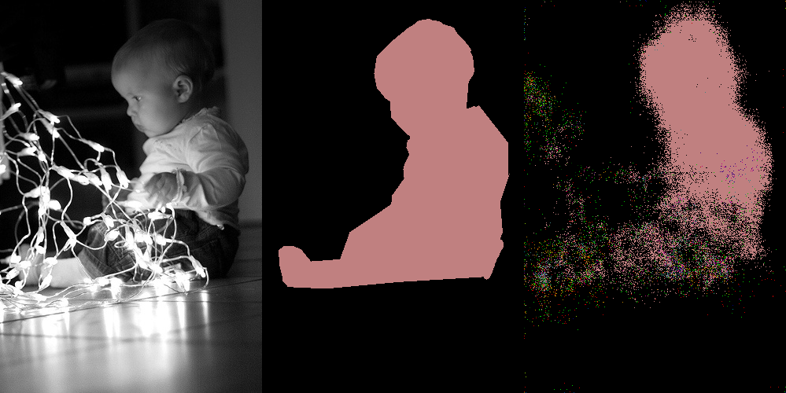

Semantic Segmentation
=====================

Descriptions
------------
various implementation using tensorflow

FCN
---

* Results after "ONLY" epoch#5 on VOC2012 Dataset, we need more than 175 epochs!!!

_

_

_

_

_

_

_

Reference List
--------------
- [Study Notes](https://github.com/stereoboy/Study/blob/master/papers/Semantic_Segmentation/Semantic%20Segmentation.ipynb)
